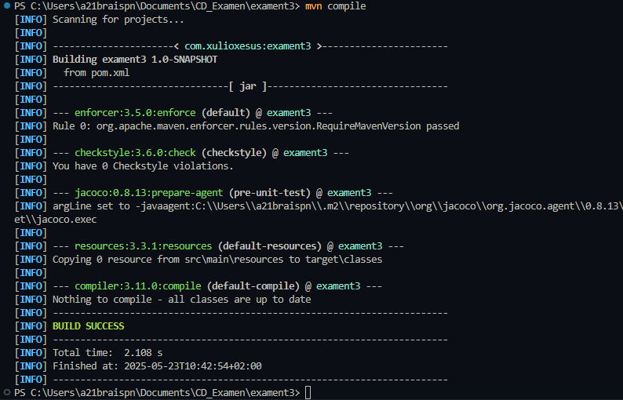
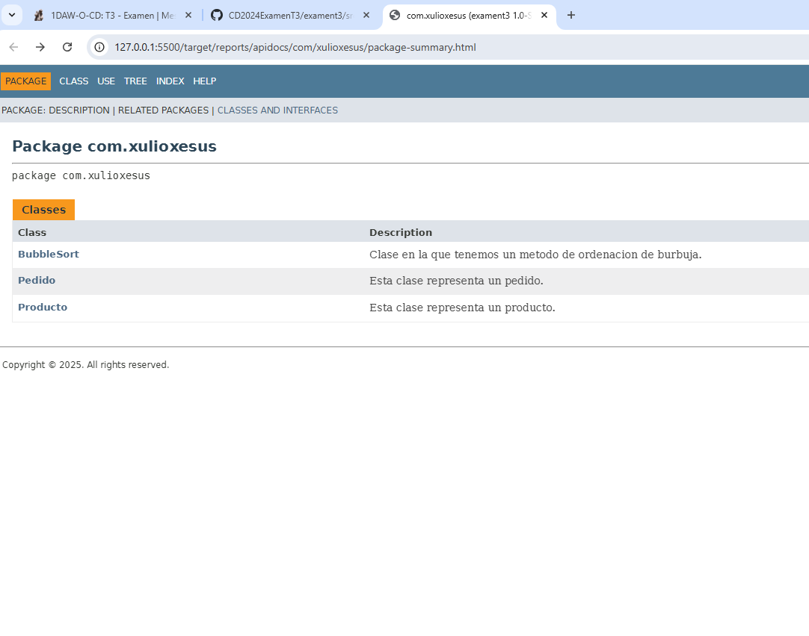
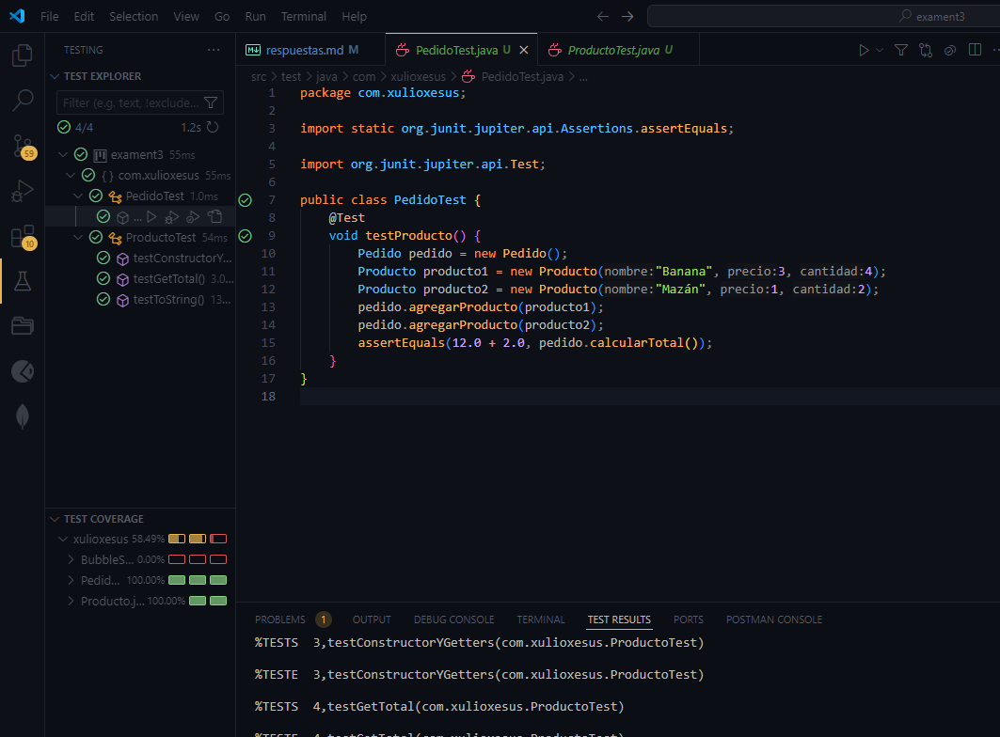

# T3 - Examen
## Ejercicio 1
Para empezar en el checkstyle.xml tuve que solucionar un problema con una etiqueta xml y cerrar algunas etiquetas \<module>, en el pom.xml tuve que borrar una dependencia que me daba error al compilar el código.

Luego en la clase BubbleSort.java tuve que solucionar varios errores de estilo como la simplificación de las expresiones booleanas.
```
src\main\java\com\xulioxesus\BubbleSort.java:[22,25] (coding) SimplifyBooleanExpression: Se puede simplificar la expresi├│n.
```
y al ejecutar ya no me daba ningún error.



## Ejercicio 2
Comenté todo el código y luego con los siguientes comandos pude crear la documentación:
```
mvn clean | mvn compile | mvn javadoc:javadoc
```
También tuve que solucionar errores de estilo como puntos finales y separación en los comentarios.



## Ejercicio 3
Cree en la carpeta de test las clases PedidoTest.java y ProductoTest.java en los que cree varios productos y pedidos, luego en el apartado de testing ejecute las pruebas con covertura y estos fueron los resultados:


